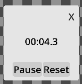
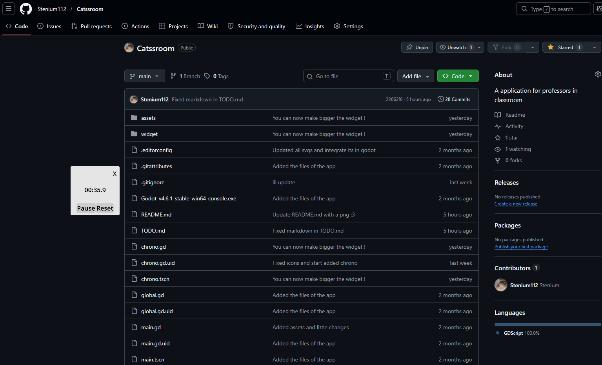
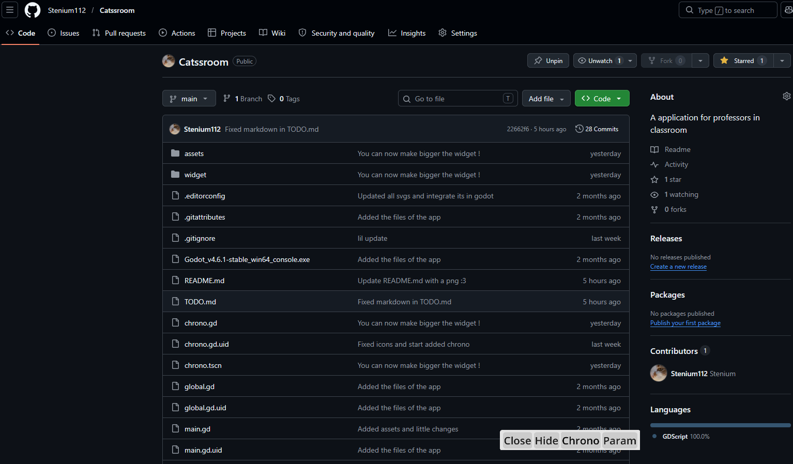

# English

## Catssroom
### About
A application for professors in classroom, made with [Godot](https://godotengine.org/en/), by a French guy.
This is inspired by [Classroom Screen](https://classroomscreen.com/)

### Screenshot

### Use/Run
For use the app you have 2 methods :
- Go to the [release page](https://github.com/Stenium112/Catssroom/releases) and download the latest version of Catssroom
- [Download the .zip](https://github.com/Stenium112/Catssroom/archive/refs/heads/main.zip)/clone the repository, extract it, [download Godot](https://godotengine.org/download/), put the executable files of godot in the extracted zip files and finally run one of them. **

** This will show the live log of the app on the console but the files are more larger and can have some experimental changes

### Build
You have to download [Godot Engine](https://godotengine.org/download/), open the project and export with a template of your choice

### Participate
You can [participate on the project](https://github.com/Stenium112/Catssroom/pulls), [help me or other person, report bug](https://github.com/Stenium112/Catssroom/issues) and maybe part of the project ?

### License
This application is licesend with the [Creative Commons BY (must have credit) NC (cannot be comercialise) SA (has to be on the same license)](https://creativecommons.org/licenses/by-nc-sa/4.0/)

So you can modify and publy this project, but you must give appropriate credits like "Originnaly created by Stenium and the community of Catssroom", you cannot commercialise this project and has to be on the same license.

# Français

## Catssroom
### À propos
Une application pour les professeurs en classe, créé avec [Godot](https://godotengine.org/fr/).
Ce project est inspiré par [Classroom Screen](https://classroomscreen.com/)

### Capture d'écran

### Utiliser/Démarrer
Pour utiliser l'application vous avez 2 méthodes :
- Aller sur la [page de mise à jour (release)](https://github.com/Stenium112/Catssroom/releases) et télécharger la dernière version de Catssroom
- [Télécharger le .zip](https://github.com/Stenium112/Catssroom/archive/refs/heads/main.zip)/cloner le repository, extrais le .zip  [Téléchargez Godot](https://godotengine.org/download/), mettez les fichier executables de Godot dans le dossier extrait du projet et executez un des fichiers Godot **

** Cela vous montrera les logs en direct de l'application mais les fichiers sont plus gros et peuvent avoir des changement experimental

### Build
Vous devez télécharger [Godot](https://godotengine.org/download/), téléchargez/cloner le repository, extraire le .zip et ouvrez dans Godot le projet.
Après exporter le avec un modèles.

### Participer
Vous pouvez [participer au projet](https://github.com/Stenium112/Catssroom/pulls), [m'aider ou aider les autres, reporter les bugs](https://github.com/Stenium112/Catssroom/issues) et peut être faire parti du projet ?

### licence
Ce projet est sous la licence [Creative Commons BY (doit avoir des crédits) NC (ne peut être commercialiser) SA (dois avoir la même licence)](https://creativecommons.org/licenses/by-nc-sa/4.0/)

Donc vous pouvez modifier ce projet et le publier autre par, mais vous devez mettre des crédits approprier comme "Créé originalement par Stenium et la communauté de Catssroom", vous ne pouvez pas commercialisez ce projet et dois avoir la même licence que le projet original.
